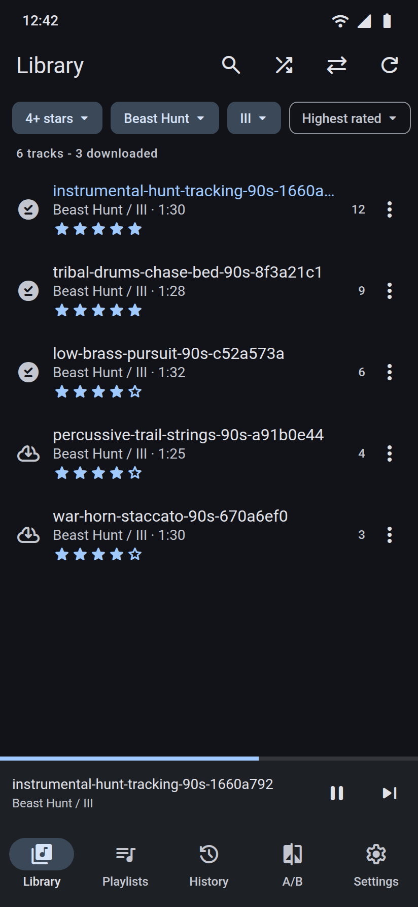
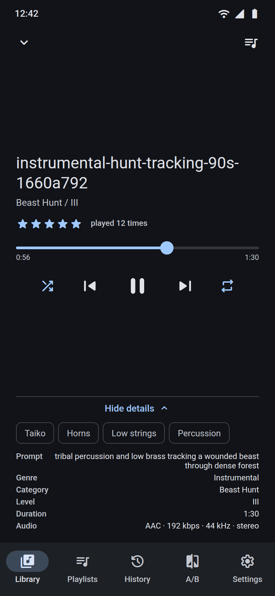
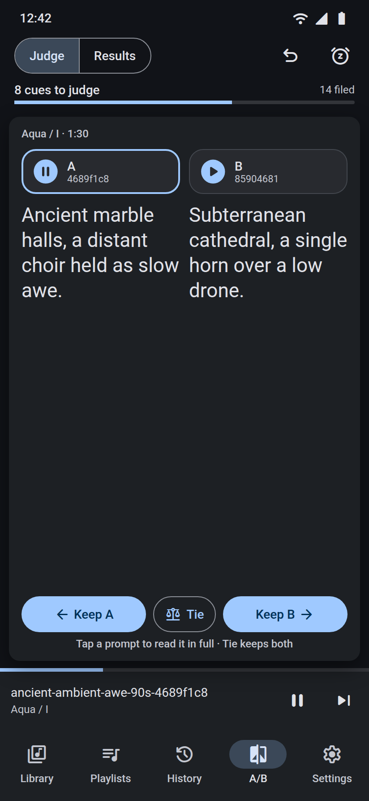
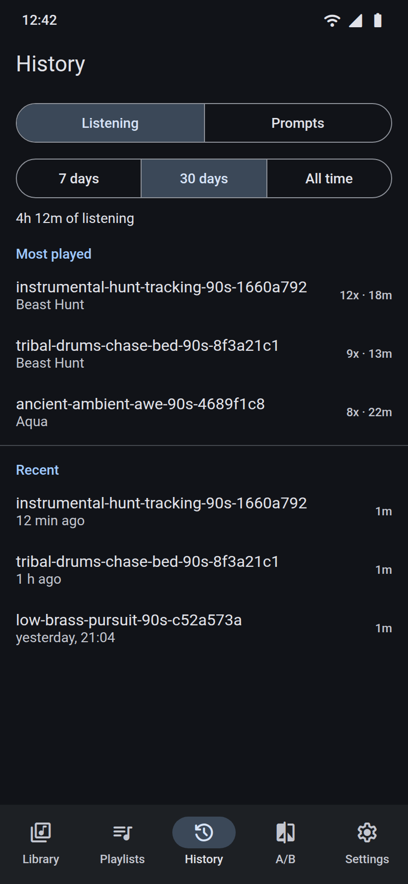
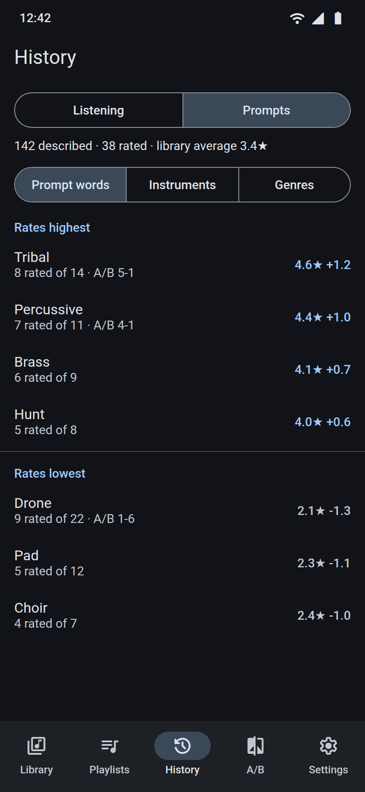
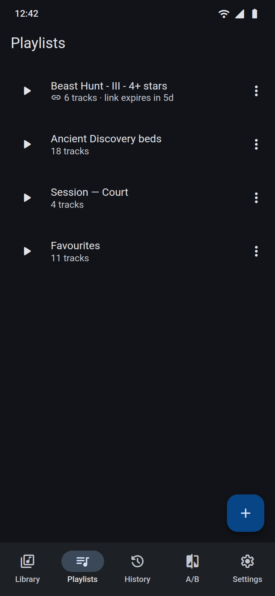
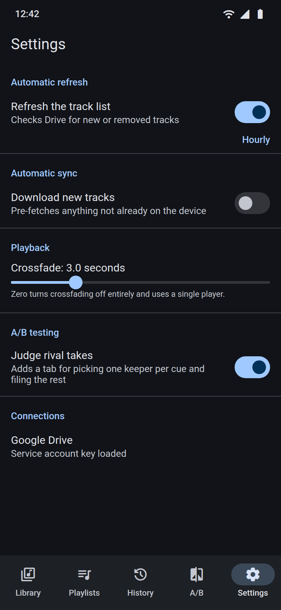
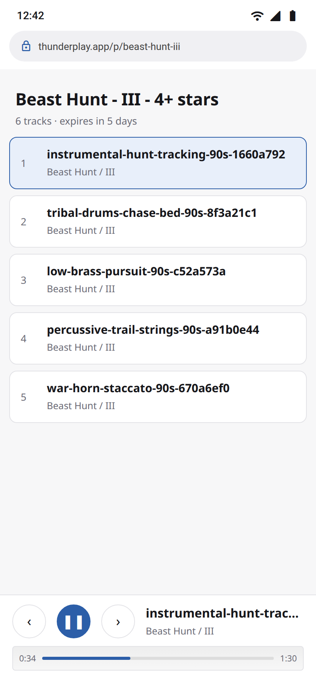

# Thunder Play

An Android music player for a personal library that lives in Google Drive, plus a public web
player so a playlist can be handed to anyone with a phone browser. No server, and nothing here
leaves the free tiers.

**Start with [docs/SETUP.md](docs/SETUP.md)** — the app needs a service-account key before it can
show anything.

The catalog is the WAV tree in `music\`. `tools/transcode/` can mirror it to smaller AAC in
`music-mobile\`, and Settings can point the app there instead, but nothing maintains that mirror
and the app does not need it.

## Screens

Library, Now Playing, playlists, listening history, prompt insights, A/B judging, settings, and
the public share player a link opens in any browser.

<p align="center">
  
  
  
</p>
<p align="center">
  
  
  
</p>
<p align="center">
  
  
</p>

| Screen | What it is showing |
|---|---|
| **Library** | Stars, category, intensity and sort combine on one row. Rate in the list; a pin means the track is on the device, a cloud means it still streams from Drive. |
| **Now Playing** | Seek, shuffle, repeat, the same 1–5 stars as the lock-screen heart, and the generator prompt, instruments and codec under *Details*. *Up next* is the queue icon. |
| **A/B** | Two rival takes of one cue. Tap either to hear it (no crossfade), swipe or tap *Keep* toward the winner, or *Tie* to keep both. The tab itself is switched on in Settings. |
| **History** | Every play, not just a counter: most-played and recent listening over 7 days, 30 days or all time. |
| **Prompts** | The same History screen's other tab. Averages your stars across prompt words (and instruments / genres); a term needs three rated tracks before it ranks. |
| **Playlists** | Lists you keep, plus a 7-day share link when one is live. The same share can be made from any filtered library view. |
| **Settings** | How often Drive is refreshed, whether new tracks download on their own, crossfade length (0–12 s), and the A/B tab. |
| **Web player** | What the other person sees. No app, expires with the link. |

## What it does

- **Syncs with Drive.** Drop a track into `Music-And-Fx-Generated-Library\music\` (or add it
  through Drive on any device) and it appears in the app. Refresh and download are separate
  toggles in Settings, each with its own interval.
- **Plays with the screen off**, with prev / play / next and a Like button on the lock screen.
- **Crossfades** between tracks on an equal-power curve, configurable from 0–12 seconds. Repeat,
  shuffle and an editable *Up next* queue sit on the Now Playing screen; repeat-one fades a track
  into itself, so an ambience bed loops with no seam.
- **Rates tracks 1–5 stars**; "liked" is simply a rating of 1 or more, so the lock-screen heart
  and the star control are the same underlying value.
- **Reads the generator's own metadata.** The prompt, genre, intensity and instrument list live in
  each source WAV's RIFF header, and a 4 KB range request per track is enough to read them — so
  search covers prompts and instruments rather than only the truncated slug in the filename, tracks
  can be filtered by genre, and Now Playing shows the sentence the track was generated from.
  Durations come from the same header.
- **Says which prompts earn stars.** History's *Prompts* tab averages your ratings across the words
  and instruments behind them, so "tribal percussive" beating "ambient drone" is a fact rather than
  a hunch. Unrated tracks are not counted as zero, and a term needs three rated tracks to be ranked.
- **Records every play**, not just a counter, so History can show most-played and listening time
  over a window.
- **Filters** by stars, category, intensity and genre — independent and combinable, so "Beast Hunt,
  level III, four stars or better" is one state rather than a mode — and **orders** by name, most
  played, highest rated, recently added, or a stable random shuffle.
- **Shares** a single track as a file through the Android share sheet, or any playlist *or
  filtered view* as a link that streams in any browser. Every link expires after 7 days.
- **Deletes safely.** Removing a track from Drive moves it — and its source WAV — into
  `_ThunderPlayTrash\`. Nothing is ever permanently deleted.
- **Judges rival takes by swiping.** Switch on *A/B testing* in Settings for a tab that deals the
  two to four renders of one cue as a card, with the prompt each take was generated from filling
  it side by side, at the same size — one sentence per take, even when they match — and never
  smaller than comfortably readable; tap a prompt to read it in full. Tap either take to hear it -
  without crossfading, so two takes never overlap - and swipe the card towards the one that wins,
  or call it a *Tie* when neither is better and keep both. Three or four takes are a knockout
  ladder, so the question on screen is always just A or B. Keepers are filed into
  `_ThunderPlayAB\good\` with the rest in `_ThunderPlayAB\bad\`; a tie is recorded as its own
  verdict, so it never counts as a win in the prompt insights. Nothing moves until a cue is
  decided, so *Undo* and *Later* cannot cost anything. The prompt is written onto each judged
  file's Drive description, so both batches stay readable. Keepers stay in the library; nothing is
  deleted.

## Layout

```
app/                     Android app (Kotlin, Compose, Media3)
  drive/                 service-account auth + Drive REST
  data/                  Room entities and DAOs
  playback/              crossfade player, media session, cache, downloads
  stats/                 ratings and play history (Room + Firestore)
  playlist/              playlists, share links, track export
  sync/                  catalog refresh, WorkManager jobs, Drive trash
  ui/                    Library, Now Playing, Playlists, History, A/B, Settings
web/                     the public share player (Firebase Hosting)
docs/screenshots/        README captures of the screens above
tools/transcode/         ffmpeg WAV -> AAC mirror
tools/screenshots/       HTML stand-ins used to render those captures
```

## Why it is built this way

Three constraints shaped most of the design, and each ruled out something simpler:

1. **Drive's `drive` scope is restricted.** Using it in a real app needs Google verification and a
   security audit; staying in "Testing" expires the refresh token weekly. A service account shared
   into the folder avoids all of it, at the cost of shipping a key inside the APK.
2. **Google blocks Drive files from being embedded on other sites.** A web player cannot stream
   from Drive at all, so shared tracks are copied to Firebase Storage and deleted when the share
   lapses.
3. **Safari on iOS will not play Opus.** The mobile format is therefore AAC in `.m4a`, which both
   ExoPlayer and every browser handle — about 40 MB more across the library, in exchange for share
   links that are not silent on an iPhone.

## Development

```bash
./gradlew assembleDebug
```

```bash
./gradlew test
```

Every push and pull request also runs that on GitHub Actions, and publishes a debug APK. The
latest successful build on `main` is at **[Releases → Latest build](https://github.com/Almantask/thunder-play/releases/latest)**
(`thunder-play.apk`). Pull requests attach the same file as a workflow artifact.

`app/src/main/assets/drive-service-account.json` is gitignored and must never be committed; treat
a built APK as a secret, since the key travels inside it. The CI APK only contains the key if the
`DRIVE_SERVICE_ACCOUNT_JSON` repository secret is set — and because this repository is public,
make it private before adding that secret, or the key leaks with every download. See
[docs/SETUP.md](docs/SETUP.md#7-download-the-latest-ci-build).
